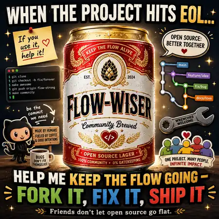

# Flow-wiser - help keep the flow going

  

**When the project hits EOL, friends do not let open source go flat.**

The Flow-wiser image is a humorous invitation to help preserve, repair, document,
test, and improve this community continuation fork.

- Fork it
- Fix it
- Ship it
- Review issues and pull requests
- Help make the Apache-2.0-only continuation sustainable

Contributions are welcome through this repository's public issues and pull
requests. Start with [FORK.md](FORK.md) for project context and licensing boundaries.

## Reusing the artwork

The image and its public-use, attribution, parody, and trademark notices are in
[community-art/README.md](community-art/README.md).
